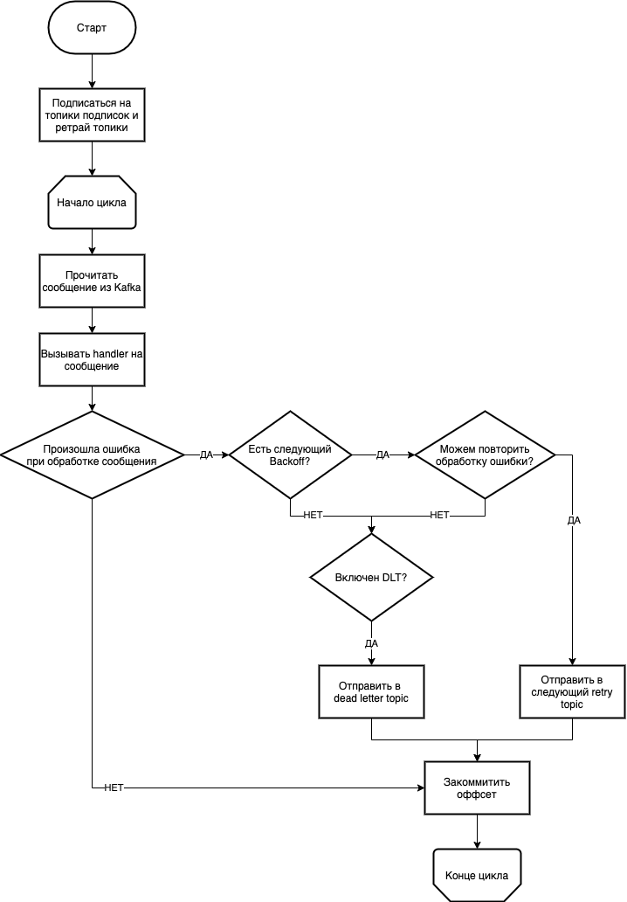

# User Guide

## Agent

Инснтанс консумера предоставляющий API для подписки на топик.

```python
from service_lib.kafka_agent import Agent, AgentSettings
from service_lib.state_manager import StateManager

state_manager = StateManager() 
settings = AgentSettings(kafka_servers=["localhost:9092"])

agent = Agent(state_manager=state_manager, settings=settings, service_name="some_service")
```

### Параметры
- `state_manager` – менеджер стейта, которым будет управлять Agent.
- `settings` – настройки, используется только `kafka_servers` – список хостов серверов кафки, передается в `aiokafka`
- `service_name` – имя [ConsumerGroup](https://docs.confluent.io/platform/current/clients/consumer.html#consumer-groups) консюмера, и имя продюсера, участвует в формировании имени ретрай топиков.

### Запуск

```python
await agent.startup()

try:
    await agent.run()
finally:
    await agent.shutdown()
```


## Добавление подписки
Агенту можно добавить N подписок на топики, на каждый топик не более одной подписки.

```python
async def handler(key: Any, value: Any, state: State) -> None:
    pass

agent.add_subscription(topic="some_topic", handler=handler)
```

### Параметры подписки
- `topic` – имя топика
- `handler` – функция-корутина, которая будет вызвана на каждое сообщение в топике
- `timeout` – таймаут на обработку сообщения хендлером
- `retry_policy` – описание правил ретраев, инстанс класса `RetryPolicy`
- `parse_key` – метод для декордирования ключа сообщения
- `parse_value` – метод для декодирования значения сообщения
  
### Handler
Хендлер должен:
- быть функцией-корутиной (то есть объявлен с `asycn def`)
- принимать на вход 3 аргумента:
   - `key` – key из сообщения топика
   - `value` – value из сообщения топика
   - `state` – текущий state из `StateManager`
- **ВАЖНО!!!** быть идемпотентным (так как текущая конфигурация консюмера дает гарантию доставки at least once), то есть вызов хендлера 2 и более раз не должен все ломать

По дефолту (если не передавать `parse_key`/`parse_value`) `key` и `value` будут иметь тип `bytes`. Для удобства можно пользоваться `pydantic` моделью для валидации `key`/`value`.

```python
from pydantic import BaseModel

class TopicMessage(BaseModel):
    user_id: int
    timestamp: int


async def handler(key: Any, value: TopicMessage, state: State) -> None:
    pass

agent.add_subscription(topic="some_topic", handler=handler, parse_value=TopicMessage.parse_raw)
```

## RetryPolicy
Содержит в себе правила ретраев ошибок обработки сообщений

### Параметры:
- `backoffs` – список инстансов `Backoff`
- `retryable_exceptions` – список классов ошибок, которые следует ретраить (дочерние классы тоже проходят проверку)
- `dlt_enabled` – флаг отвечающий за DLT(Dead Letter Topic)

`Backoff` содержит в себе описание "раунда ретрая":
- `name` – имя "раунда ретрая" (обычно соответсвует промежутку времени, например `3m`, `10s`, `1h`), участвует в формировании имени ретрай топика
- `delta` – инстанс `datetime.timdelta`, описывающий минимальный промежуток времени, после которого можно еще раз попробовать обработать сообщение


### Примеры

Дефолтная `RetryPolicy`.

В случае ошибки сообщение будет обработано заново через 1 минуту, через 15 минут, через 1 час, после этого оно будет отправлено в DLT.
```python
default_backoffs = [
    Backoff(name="1m", delta=timedelta(minutes=1)),
    Backoff(name="15m", delta=timedelta(minutes=15)),
    Backoff(name="1h", delta=timedelta(hours=1)),
]
default_retry_policy = RetryPolicy(
    backoffs=default_backoffs,
    retryable_exceptions=retryable_exceptions,
    dlt_enabled=True,
)
```

`RetryPolicy` без ретраев
```python
no_retry_policy = RetryPolicy(backoffs=[], retryable_exceptions=[], dlt_enabled=False)
```


### Flowchart обработки сообщений: 

[source](https://drive.google.com/file/d/10nrV0MisaTlY0LTi-12u7BWchTWOZzrD/view?usp=sharing)

**Подписаться на топики подписок и ретрай топики**

При старте Agent подписывается на топики добавленыые через `add_subscription` и на "ретрай топики".

Ретрай топики формируются исходя из списка `backoff` в `retry_policy` каждой подписки. 

У каждого сервиса-консюмера должны быть свои ретрай топики (и DLT), потому что ошибки одного сервиса не должны аффектить другие сервисы.

Пример:
```python
agent = Agent(state_manager=state_manager, settings=settings, service_name="some_service")

agent.add_subscription(topic="some_topic", handler=handler, retry_policy=default_retry_policy)
```

В такой конфигурации Agent подпишется на слеудющие топики:
- some_topic
- some_topic__some_service__1m
- some_topic__some_service__15m
- some_topic__some_service__1h


**Есть следующий Backoff?**

Консюмер может получать сообщения как из основного топика, так и из "ретрай" топика. К "ретрай" топику привязан текущий `backoff` этого топика и следующий `backoff` (если есть).

**Можем повторить обработку ошибки?**

Соответствует ли ошибка какой-либо ошибке из `retryable_exceptions`. Cоответствие проверяется вызовом `isinstance`, поэтому дочерние ошибки тоже учитываются.


## Технические детали
Agent работает поверх [aiokafka](https://aiokafka.readthedocs.io/en/stable/). 

В ней нет средств для получения сообщений из конкретного топика. Но зато есть класс с колбеками на выдачу/возврат партиций, [подробнее](https://aiokafka.readthedocs.io/en/stable/api.html#consumer-rebalance-listener).

В этом колбеке создаются/удаляются `PartitionConsumer` на каждую партицию. `PartitionConsumer` в бесконечном цикле вычитывает сообщения из партиции и пытается их обработать.

Такое решение позволяет как консюмить все в одном процессе, так и безопасно масштабироваться.


